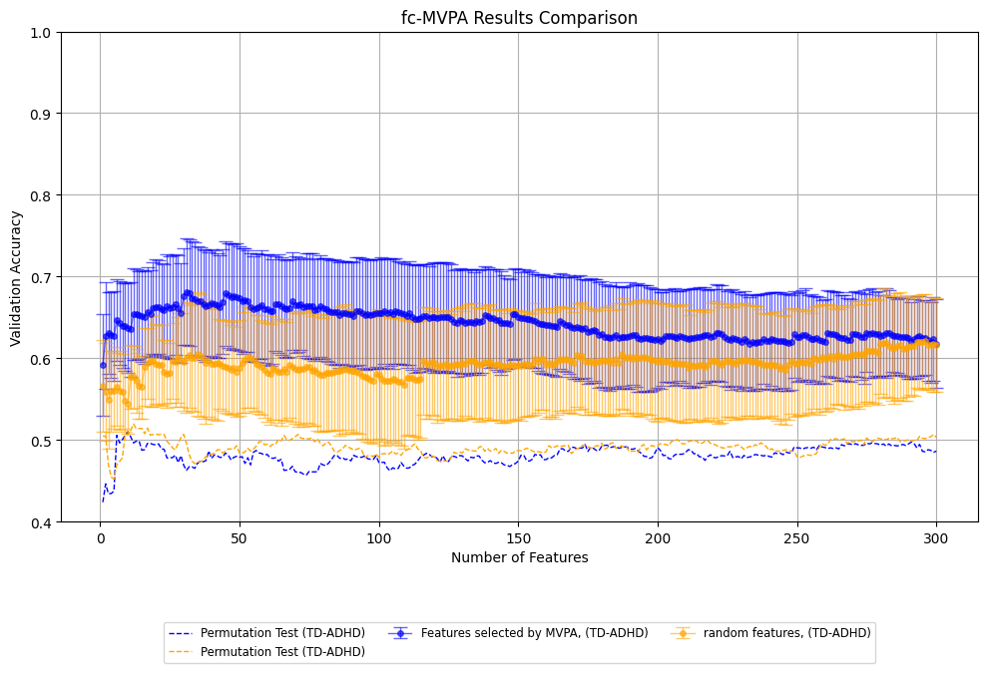
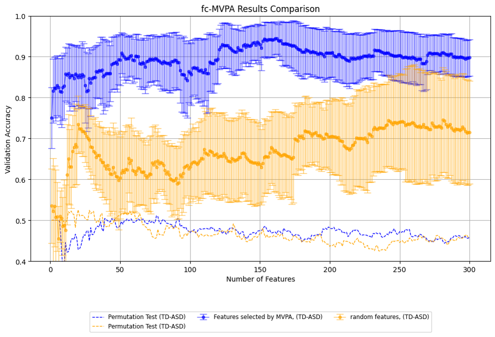

# 🔬 fMRI-Based Functional Connectivity Analysis for Neurodevelopmental Disorders

  

This repository houses the implementation and analysis pipeline for a research project focusing on the classification of neurodevelopmental disorders, including ADHD (Attention Deficit Hyperactivity Disorder) and ASD (Autism Spectrum Disorder), using functional connectivity (FC) features derived from fMRI data. 

---

## 📖 Overview

Understanding the neural basis of neurodevelopmental disorders is critical for early diagnosis and intervention. This project leverages advanced computational methods to analyze brain connectivity and classify subjects based on their clinical conditions. It combines both domain knowledge from neuroscience and data-driven machine learning approaches to enhance diagnostic accuracy and explore the mechanisms underlying these conditions.

---

## 📖 Key Concepts

### What is Functional Connectivity?

Functional connectivity (FC) is a measure of the temporal synchronization between spatially distinct regions of the brain. It provides insights into the functional architecture of the brain by analyzing patterns of correlated activity in resting-state fMRI data. 

#### Characteristics of FC:
- **Static Functional Connectivity (sFC)**: Measures consistent, long-term correlations across the entire duration of the fMRI scan.
- **Dynamic Functional Connectivity (dFC)**: Captures temporal fluctuations in connectivity by analyzing overlapping "windows" of time series data. This method is particularly suited to studying transient brain states and their association with clinical conditions.

#### Methodology:
- Correlation matrices are computed from fMRI time series using a predefined brain atlas(AAL3) with 166 regions of interest (ROIs).
- Only positive correlations are used for analysis, as negative correlations are challenging to interpret clinically.

### What is fc-MVPA?

Functional connectivity-based multivariate pattern analysis (fc-MVPA) is a framework that uses statistical and machine learning methods to analyze patterns within FC data for prediction or classification. It is particularly suited for neuroimaging studies that aim to link brain connectivity to behavioral or clinical outcomes.

Especially, the use of non-parametric statistical tests for feature selection is a distinctive aspect of this study. By employing methods such as the Mann-Whitney U test, features were ranked based on their statistical significance rather than relying solely on traditional machine learning feature selection algorithms. This approach demonstrated that even using purely statistical methods, it is possible to achieve competitive classification performance. Specifically, the statistical feature selection approach yielded comparable or superior results to baseline methods that utilized random or heuristic feature selection, underscoring the efficacy of clinically informed, data-driven statistical methodologies in identifying meaningful connectivity patterns.

#### Components:
1. **Feature Extraction**:
   - Full correlation matrices are used as the input data.
   - Features are derived from ROI-to-ROI connectivity values.
   - This repository does not include the preprocessing pipeline of fMRI data, since the experiment was conducted with ROI - time series data formerly extracted by SNUH clinicians.
   
2. **Feature Selection**:
   - Data-driven approaches: Nonparametrical Statistic techniques (e.g., Mann-Whitney U test)

3. **Classification**:
   - Machine learning models, such as Support Vector Machines (SVMs), are trained to classify clinical groups (e.g., ADHD vs. TD, ASD vs. TD).

4. **Confounding Variable Removal**:
   - Propensity score matching (PSM) is applied to address potential biases due to confounding variables, such as age and sex.

---

## 📖 Research Objectives and Significance

### Objectives:
1. **Feature Optimization**:
   - Identify and rank connectivity features that significantly contribute to classification accuracy.
   - Compare static and dynamic functional connectivity approaches for feature selection.

2. **Group Classification**:
   - Develop and validate machine learning models for classifying subjects into clinical groups (e.g., ADHD, ASD, typically developing (TD)).
   
3. **Bias Mitigation**:
   - Remove confounding effects of demographic variables like age and sex to ensure the robustness of findings.

4. **Dynamic Functional Connectivity**:
   - Explore the added value of dFC metrics in representing the temporal variability of brain states.

### Significance:
- **Clinical Impact**:
  - Provides a non-invasive method for early detection and diagnosis of neurodevelopmental disorders using resting-state fMRI.
  - Supports personalized treatment planning by identifying specific connectivity patterns associated with ADHD and ASD.
  
- **Scientific Contribution**:
  - Advances understanding of the neural mechanisms underlying neurodevelopmental disorders.
  - Demonstrates the potential of exploiting statistical feature extraction for functional connectivity research.

- **Innovative Approach**:
  - Integrates static and dynamic connectivity metrics for enhanced classification performance.
  - Uses state-of-the-art feature selection and bias removal techniques to ensure reliable and interpretable results.

---

## 📖 Pipeline

The project follows a structured analysis pipeline:
1. **Data Preprocessing**:
   - Correlation matrices are generated from ROI time series using a brain atlas with 166 parcellations.
   - Positive correlations are retained after Fisher Z-transformation.

2. **Feature Selection**:
   - Features are ranked based on statistical significance and clinical relevance.
   - High-ranking features are progressively added to models to optimize performance.

3. **Classification**:
   - Machine learning models (e.g., SVM) are trained and validated on selected features.
   - Model performance is assessed using metrics such as accuracy and AUC.

4. **Dynamic Functional Connectivity Analysis**:
   - Sliding window techniques are applied with varying window sizes and steps (e.g., window size = 30/60, step = 5/30).
   - Temporal variability in connectivity is analyzed to identify dynamic biomarkers.

5. **Confounding Variable Removal**:
   - Propensity score matching is employed to address demographic biases, ensuring the comparability of clinical groups.

6. **Evaluation**:
   - Classification results are evaluated against baseline models using both static and dynamic connectivity features.
   - Feature importance is visualized using tools like BrainNet Viewer.

---

## 📖 Dataset

The study dataset consists of resting-state fMRI scans from three groups:
1. ADHD group (146 cases after preprocessing).
2. ASD group (116 cases after preprocessing).
3. TD group (131 cases after preprocessing).

#### Demographics:
- Age range: ASD group is significantly younger (mean = 4.9 years) compared to ADHD and TD groups (mean ≈ 9 years).
- Sex distribution: Balanced across groups, removing significant gender biases.

---

## 📖 Results

### Key Findings:
- **Static FC**:
  - Achieved low accuracy due to the small number of patients, highlighting the need for dynamic investigation.

- **Dynamic FC**:
  - Showed improved classification performance for certain window configurations.
  - Best test accuracy of 63.2% achieved for ADHD classification.
  - Best test accuracy of 85.1% achieved for ASD classification.

  

  

---

  

- **Feature Selection**:
  - Statistical feature selection significantly outperformed random feature selection.

---

## References

1. Austin, P. C. (2011). An introduction to propensity score methods for reducing the effects of confounding in observational studies. *Multivariate Behavioral Research, 46(3), 399–424*. https://doi.org/10.1080/00273171.2011.568786
2. Nah, Y., Shin, N.-Y., Yi, S., Lee, S.-K., & Han, S. (2018). Altered task-dependent functional connectivity patterns during subjective recollection experiences of episodic retrieval in postpartum women. *Neurobiology of Learning and Memory, 150, 116–135*. https://doi.org/10.1016/j.nlm.2018.03.009
3. Tzourio-Mazoyer, N., et al. (2013). The AAL Toolbox for the analysis of brain volume and surface-based data. *PLOS ONE, 8(7), e68910*. https://doi.org/10.1371/journal.pone.0068910
4. Zhang, Y., Brady, M., & Smith, S. (2001). Segmentation of brain MR images through a hidden Markov random field model and the expectation-maximization algorithm. IEEE Transactions on Medical Imaging, 20(1), 45–57. https://doi.org/10.1109/42.906424

---